# Mermaid - Markdown Diagram Syntax

**Mermaid** is a JavaScript-based diagram and flowchart generation tool that renders natively in Markdown. Diagrams are embedded directly in `.md` files and render automatically on GitHub, GitLab, and modern documentation sites.

## Overview

Mermaid diagrams in this directory:

1. **class_diagram.md** - Pydantic model class hierarchy
   - BaseModel inheritance
   - Request/response models
   - API endpoint usage
   - Field definitions and examples

2. **sequence_diagram.md** - Instance launch sequence
   - User request to response flow
   - Background task execution
   - Error handling path
   - Timing information

3. **component_diagram.md** - System architecture
   - Component relationships
   - Data flow
   - Layer organization
   - External service interactions

## Installation

**No installation required!** Mermaid is rendered by:
- GitHub (automatically)
- GitLab (automatically)
- Modern Markdown editors
- Web browsers via CDN

To test locally:
```bash
# Use online editor
https://mermaid.live

# Or install mermaid-cli
npm install -g @mermaid-js/mermaid-cli
mmdc -i diagram.md -o diagram.svg
```

## Quick Start

View diagrams directly in GitHub:
1. Open any `.md` file in browser (GitHub automatically renders)
2. Mermaid code blocks render as diagrams
3. No build step required

## Diagram Types

### Class Diagram

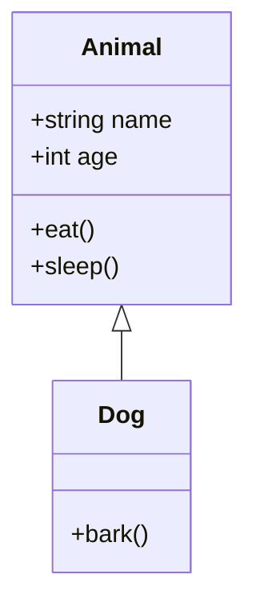

**Symbols**:
- `<|--` : Inheritance
- `*--` : Composition
- `o--` : Aggregation
- `--` : Association

### Sequence Diagram

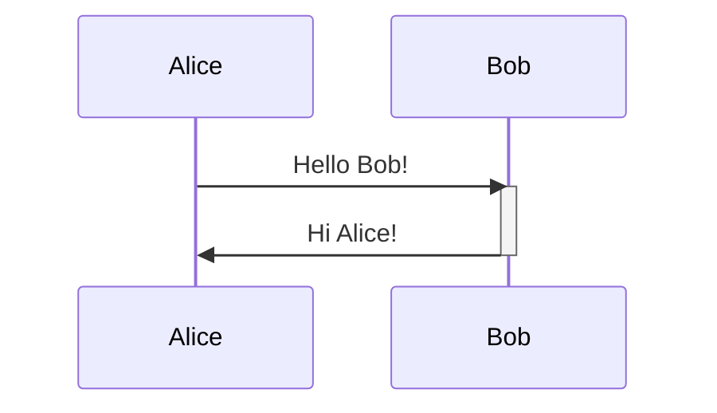

**Syntax**:
- `->>`  : Solid arrow
- `-->>` : Dashed arrow
- `activate` / `deactivate` : Show lifeline

### Component Diagram

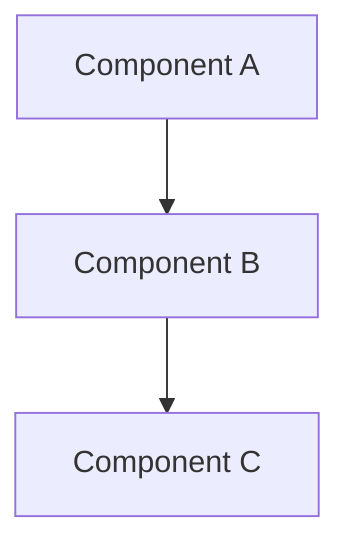

**Node Types**:
- `[rounded]` - Rectangle
- `(circle)` - Circle
- `{diamond}` - Diamond
- `[[subroutine]]` - Subroutine

### Flowchart/Graph

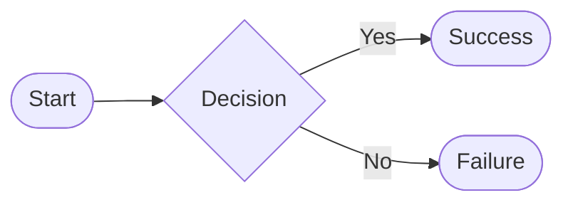

**Connections**:
- `-->` : Solid arrow
- `-.->` : Dotted arrow
- `==>` : Thick arrow

### State Diagram

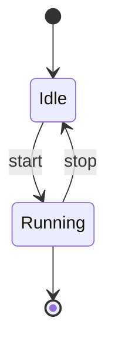

### ER Diagram (Entity Relationship)

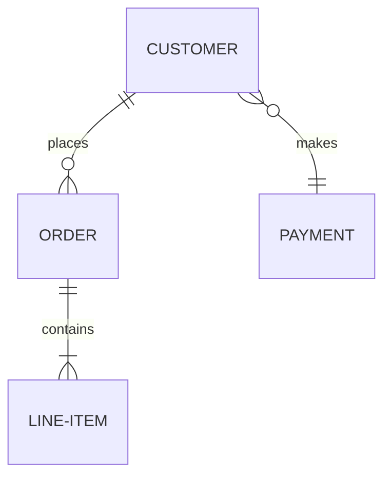

## For EC2-Automator

### What Mermaid Excels At
✅ Class diagrams (Pydantic models)
✅ Sequence diagrams (async workflows)
✅ Component diagrams (system architecture)
✅ Flowcharts (task status transitions)
✅ State diagrams (task lifecycle)
✅ GitHub integration (no build required)

### What Mermaid Doesn't Handle Well
❌ Dependency graphs (use pydeps)
❌ AWS architecture icons (use diagrams library)
❌ Complex layouts (PlantUML better)
❌ Very large diagrams (rendering performance)

## GitHub Integration

### Rendering in README.md

```markdown
## System Architecture

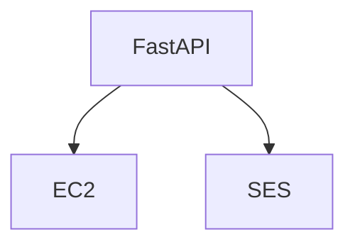
```

This renders automatically on GitHub!

### Benefits

✅ **No build step required**
✅ **Version controlled** (text-based)
✅ **Renders in GitHub UI** automatically
✅ **Mobile friendly**
✅ **Accessible** (text fallback)

## Advanced Features

### Themes

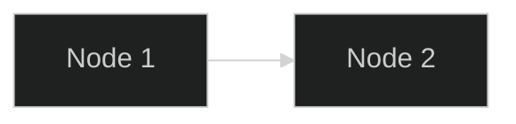

Available themes:
- `default`
- `forest`
- `dark`
- `neutral`
- `base`

### Custom Styling

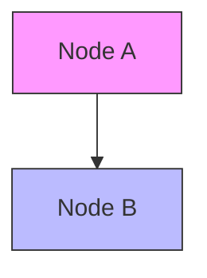

### Subgraphs

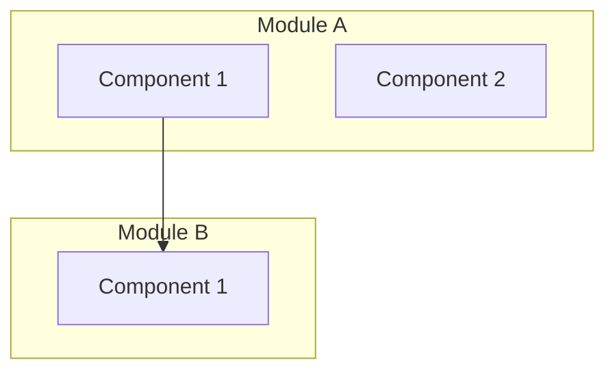

## Workflow Integration

### 1. Pull Requests
```markdown
## Changes in this PR

### Before
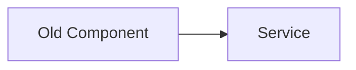

### After
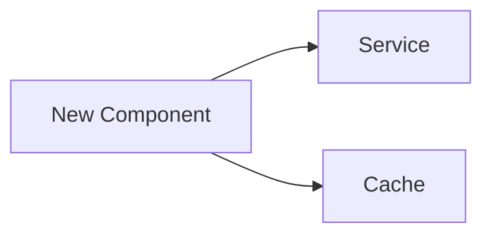
```

### 2. API Documentation
```markdown
## Instance Launch Workflow

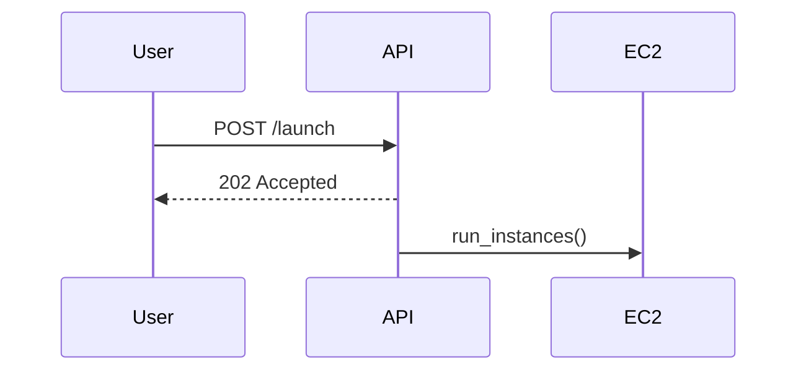
```

### 3. Architecture Docs
```markdown
## System Architecture

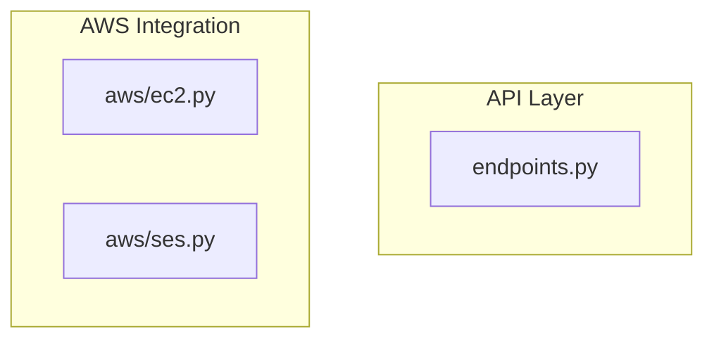
```

## Comparison with Other Tools

| Feature | Mermaid | PlantUML | pyreverse | diagrams |
|---------|---------|----------|-----------|----------|
| GitHub rendering | ✅ | ❌ | ❌ | ❌ |
| Markdown native | ✅ | ❌ | ❌ | ❌ |
| No build required | ✅ | ❌ | ❌ | ❌ |
| Class diagrams | ✅ | ✅ | ✅ | ❌ |
| Sequence diagrams | ✅ | ✅ | ❌ | ❌ |
| Component diagrams | ✅ | ✅ | ❌ | ✅ |
| AWS icons | ❌ | ❌ | ❌ | ✅ |
| Professional styling | ❌ | ✅ | ❌ | ✅ |

## Troubleshooting

### Diagram not rendering in GitHub
- Ensure code block has ` ```mermaid ` fence
- Check Markdown syntax is valid
- Try mermaid.live to validate syntax

### Rendering issues in editor
- Some editors may not support Mermaid
- Use GitHub web UI or mermaid.live
- Try updating editor to latest version

### Large diagrams won't render
- Simplify diagram structure
- Break into multiple smaller diagrams
- Use subgraphs to organize

### Performance issues
- Reduce number of nodes
- Use simpler layouts
- Consider splitting into multiple diagrams

## Best Practices

1. **Keep diagrams simple** - Easier to understand and maintain
2. **Use consistent naming** - Node names should be descriptive
3. **Organize with subgraphs** - Group related components
4. **Add notes and comments** - Explain complex relationships
5. **Version control** - Text-based, so great for git
6. **Document purposes** - Explain what each diagram shows

## References

- [Mermaid Documentation](https://mermaid.js.org)
- [Mermaid Syntax Guide](https://mermaid.js.org/intro/index.html)
- [GitHub Mermaid Support](https://github.blog/2022-02-14-include-diagrams-in-your-markdown-files-with-mermaid/)
- [Mermaid Live Editor](https://mermaid.live)

## Further Reading

- [Class Diagram Guide](https://mermaid.js.org/syntax/classDiagram.html)
- [Sequence Diagram Guide](https://mermaid.js.org/syntax/sequenceDiagram.html)
- [Flowchart Guide](https://mermaid.js.org/syntax/flowchart.html)
- [State Diagram Guide](https://mermaid.js.org/syntax/stateDiagram.html)

---

**Tool Type**: Markdown-Native Diagrams
**License**: MIT
**Requires**: Modern browser or GitHub/GitLab
**IDE Support**: VS Code, JetBrains, Vim, Emacs
