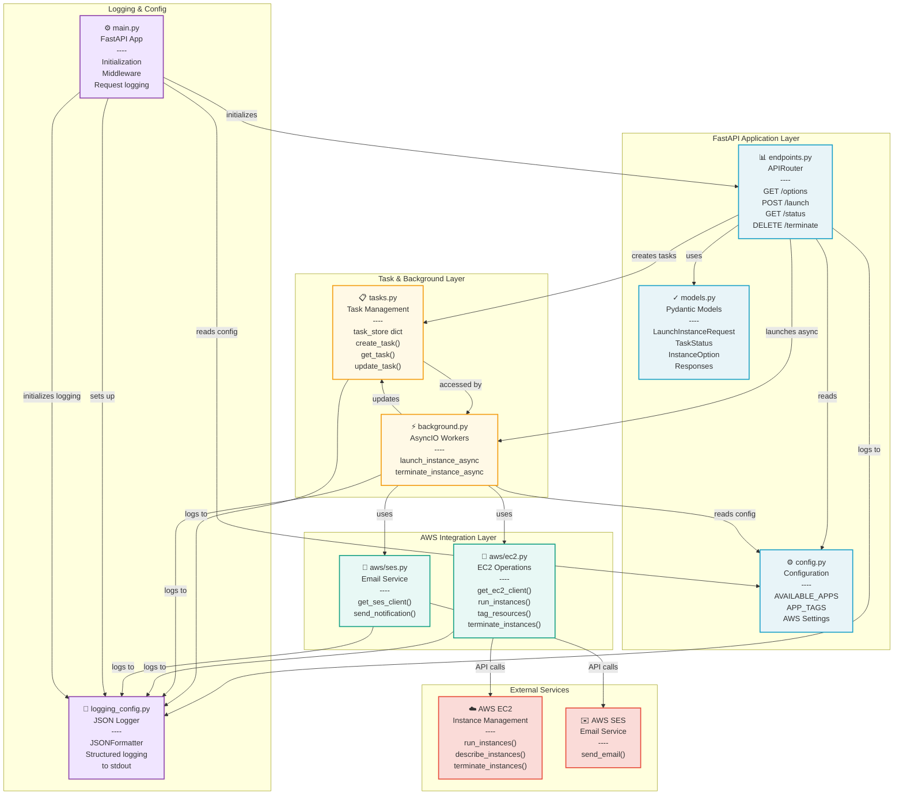

# System Component Architecture

This diagram shows the component structure of the EC2-Automator system and how components interact.

## Component Diagram



## Component Descriptions

### API Layer (FastAPI)

#### **endpoints.py** - REST API Routes
- **Responsibility**: Handle HTTP requests and responses
- **Routes**:
  - `GET /options` - List available instance types and apps
  - `POST /launch` - Initiate instance provisioning
  - `GET /status/{task_id}` - Check provisioning status
  - `DELETE /terminate/{instance_id}` - Terminate instance
- **Dependencies**:
  - models.py (validation)
  - tasks.py (task state)
  - background.py (async execution)
  - logging_config.py (structured logging)

#### **models.py** - Pydantic Validation
- **Responsibility**: Define and validate data schemas
- **Models**:
  - `LaunchInstanceRequest` - Launch request validation
  - `LaunchInstanceResponse` - Launch response schema
  - `TaskStatus` - Task status response
  - `TerminateInstanceResponse` - Termination response
  - `InstanceOption` - Options listing response
  - `ErrorResponse` - Error responses
- **All inherit from**: `pydantic.BaseModel`

#### **config.py** - Configuration
- **Responsibility**: Centralize configuration constants
- **Contains**:
  - `AVAILABLE_APPS` - Maps app names to bash scripts
  - `INSTANCE_TYPES` - Allowed EC2 instance types
  - `AWS_REGION` - Default AWS region
  - `SES_SENDER` - Email sender address

### Task Management Layer

#### **tasks.py** - In-Memory Task Store
- **Responsibility**: Manage task lifecycle
- **Functions**:
  - `create_task()` - Initialize new task
  - `get_task(task_id)` - Retrieve task status
  - `update_task()` - Update task progress
  - `clear_tasks()` - Cleanup completed tasks
- **Data Structure**: Dict with task_id as key
- **States**: PENDING → SUCCESS or FAILED

#### **background.py** - Async Workers
- **Responsibility**: Execute long-running provisioning
- **Functions**:
  - `launch_instance_async()` - Provision EC2 instance
  - `terminate_instance_async()` - Terminate instance
- **Execution**: Via `asyncio.create_task()`
- **Dependencies**:
  - EC2 client (provisioning)
  - SES client (notifications)
  - Task store (status updates)

### AWS Integration Layer

#### **aws/ec2.py** - EC2 Operations
- **Responsibility**: AWS EC2 API wrapper
- **Functions**:
  - `get_ec2_client()` - Initialize boto3 client
  - `run_instances()` - Launch EC2 instance
  - `tag_resources()` - Tag instance
  - `terminate_instances()` - Stop and terminate
  - `get_instance_details()` - Fetch instance info
- **Error Handling**: Catch `ClientError`, log, raise `HTTPException`

#### **aws/ses.py** - Email Notifications
- **Responsibility**: AWS SES API wrapper
- **Functions**:
  - `get_ses_client()` - Initialize boto3 client
  - `send_notification()` - Send email via SES
- **Email Types**:
  - Success: Instance details, SSH command
  - Failure: Error message, troubleshooting
- **Error Handling**: Catch `ClientError`, log failures

### Logging & Support

#### **logging_config.py** - Structured Logging
- **Responsibility**: Configure JSON logging
- **Features**:
  - `JSONFormatter` class
  - Structured output to stdout
  - Includes timestamp, level, message, extras
  - Production-ready format
- **Used by**: All modules for logging

#### **main.py** - FastAPI Initialization
- **Responsibility**: Application setup and entry point
- **Tasks**:
  - Create FastAPI app
  - Configure logging
  - Setup middleware
  - Mount routers
  - Add health check endpoint

### External Services

#### **AWS EC2** - Cloud Infrastructure
- **Operations**: Run, describe, terminate instances
- **Accessed by**: aws/ec2.py via boto3
- **Free Tier**: t3.micro, t3.small (x86_64 Linux)

#### **AWS SES** - Email Service
- **Operations**: Send email messages
- **Accessed by**: aws/ses.py via boto3
- **Free Tier**: 62,000 emails/day

## Data Flow

### Instance Launch Data Flow
```
User Request
    ↓
endpoints.py (validation via models.py)
    ↓
tasks.py (create task entry)
    ↓
background.py (async execution)
    ↓
aws/ec2.py → AWS EC2 (run_instances)
    ↓
aws/ses.py → AWS SES (send_email)
    ↓
tasks.py (update status)
    ↓
User polls GET /status/{task_id}
```

### Logging Flow
```
All components
    ↓
logging_config.py (JSONFormatter)
    ↓
stdout (structured JSON logs)
```

## Coupling Analysis

**Good Coupling** ✅
- Clear separation of concerns
- Logging integrated across layers
- Configuration centralized
- AWS clients isolated

**Areas to Monitor** ⚠️
- Task store is in-memory (single-threaded)
- No persistence between restarts
- No rate limiting on task creation
- Synchronous EC2 polling (could timeout)

## Scalability Considerations

For production use:
- Replace in-memory task store with Redis/DB
- Add job queue (Celery, RQ)
- Implement rate limiting
- Add request authentication/authorization
- Setup CloudWatch monitoring
- Add request/response caching

---

**Last Updated**: 2026-03-03
