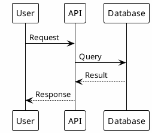
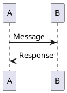
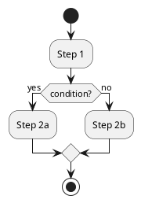
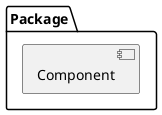
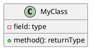

# PlantUML - Comprehensive UML Diagrams

**PlantUML** is the professional standard for text-based UML diagram generation. It supports all major UML diagram types and produces high-quality output.

## Overview

PlantUML diagrams in this directory:

1. **sequence_launch.puml** - Async instance launch workflow
   - Shows interaction between user, API, background worker, EC2, and SES
   - Demonstrates non-blocking request/response pattern
   - Illustrates error handling path

2. **activity_background.puml** - Background task processing
   - Shows step-by-step task execution flow
   - Decision points for success/failure
   - Error handling and notifications

3. **component_architecture.puml** - Component relationships
   - Shows module dependencies
   - Data flow between components
   - External service interactions

4. **deployment_aws.puml** - AWS infrastructure deployment
   - Shows Docker, VPC, EC2, security groups, IAM, SES
   - Free tier constraints and limits
   - Cost information

5. **class_models.puml** - Pydantic model class hierarchy
   - All request/response models
   - Inheritance from BaseModel
   - Field definitions and relationships

## Installation

```bash
# System dependencies
sudo apt-get install default-jre  # Java runtime
sudo apt-get install plantuml      # PlantUML

# Verify installation
plantuml -version
```

## Quick Start

```bash
# Generate all diagrams (PNG and SVG)
bash generate.sh

# View diagrams
# - PNG: for embedding in documentation
# - SVG: for web display (scalable)
```

## Diagram Details

### sequence_launch.puml

**Shows**: Complete async instance launch sequence

```
User Request
    ↓
FastAPI Endpoint (validates, creates task)
    ↓
Returns HTTP 202 Accepted immediately
    ↓
Background Worker starts async
    ↓
EC2 Client: run_instances()
    ↓
Tag instance
    ↓
SES: Send notification email
    ↓
Update task status
```

**Key Points**:
- Non-blocking response to user
- Parallel execution with par/fork
- Error handling with separate path
- Email notifications on success/failure

**Interactions**:
- User → FastAPI: REST API call
- FastAPI → Task Store: CRUD operations
- FastAPI → Background Worker: Task creation
- Background Worker → EC2: Provisioning
- Background Worker → SES: Notifications
- Background Worker → Task Store: Status updates

### activity_background.puml

**Shows**: Detailed background task execution flow

```
Start
    ↓
Validate request
    ↓
Create task entry
    ↓
Fork: Return HTTP 202 AND background worker
    ↓
Initialize EC2 client
    ↓
Prepare UserData script
    ↓
Decision: Instance creation succeeds?
    ├─ YES: Tag, wait for status, send success email
    └─ NO: Log error, send failure email, update task
    ↓
Stop
```

**Key Points**:
- Shows decision logic (if/else)
- Fork for parallel execution
- All steps logged to JSON
- Email notifications in all cases

### component_architecture.puml

**Shows**: Internal component dependencies

```
Endpoints (APIRouter)
    ├─ Models (Pydantic)
    ├─ Tasks (Task Store)
    ├─ Background (Async Workers)
    └─ Logging (JSON Logger)
        ├─ EC2 Client (Boto3)
        ├─ SES Client (Boto3)
        └─ Config (Constants)
```

**Key Points**:
- All components and their relationships
- Data flow between modules
- External AWS service dependencies
- Logging integration

### deployment_aws.puml

**Shows**: AWS infrastructure and security

```
Docker Container (FastAPI)
    ↓
EC2 Host Instance (t3.micro)
    ↓
Default VPC (Free Tier)
    ├─ Auto-provisioned EC2 instances
    ├─ Security Group rules
    └─ IAM Instance Profile
    ↓
AWS Services
    ├─ EC2 API (provisioning)
    ├─ SES (email notifications)
    └─ CloudWatch (optional logging)
```

**Key Points**:
- Free tier eligible resources
- Security group rules (SSH, HTTP, HTTPS, DB ports)
- IAM permissions (least privilege)
- Cost estimates
- Deployment constraints

### class_models.puml

**Shows**: Pydantic model hierarchy

```
BaseModel (pydantic)
    ├─ InstanceOption
    ├─ LaunchInstanceRequest
    ├─ LaunchInstanceResponse
    ├─ TaskStatus
    ├─ TerminateInstanceResponse
    └─ ErrorResponse
```

**Key Points**:
- All models inherit from BaseModel
- Field definitions with types
- Relationships between models
- Example JSON payloads
- Validation rules

## Advanced Usage

### Generate Only PNG (Faster)

```bash
plantuml -tpng *.puml
```

### Generate Only SVG (Scalable)

```bash
plantuml -tsvg *.puml
```

### Generate ASCII Art

```bash
plantuml -ttxt sequence_launch.puml
```

### Generate with Higher Resolution

```bash
plantuml -tpng -Djava.awt.headless=true sequence_launch.puml
```

### Generate PDF (Requires GraphViz)

```bash
plantuml -tpdf *.puml
```

## Editing Diagrams

### PlantUML Syntax Basics



### Diagram Types

**Sequence Diagrams**:


**Activity Diagrams**:


**Component Diagrams**:


**Class Diagrams**:


## Online Editor

For quick testing and learning:
- **PlantUML Online**: https://www.plantuml.com/plantuml/uml/
- Paste code → See rendered output
- Export as PNG, SVG, PDF
- Permalink sharing

## Troubleshooting

### plantuml: command not found

```bash
sudo apt-get install plantuml
# Or use Python wrapper:
pip install plantuml
```

### Java heap space error

```bash
# Increase Java heap size
export _JAVA_OPTIONS="-Xmx1024m"
plantuml -tpng diagram.puml
```

### SVG rendering issues

- Use latest plantuml: `sudo apt-get update && sudo apt-get install --only-upgrade plantuml`
- Some browsers have better SVG support than others
- Chrome/Firefox recommended

### Output looks blurry

- Use SVG format instead of PNG
- Or regenerate with `-Dsvg.scale=2`

## For EC2-Automator

**Best for:**
- Documenting async workflows ✅
- Showing AWS infrastructure ✅
- Illustrating component interactions ✅
- Process flows and decision logic ✅
- Deployment architecture ✅

**Can also create:**
- State diagrams (task status transitions)
- Use case diagrams (system functionality)
- Timing diagrams (request/response timing)
- Entity relationship diagrams (task store)

## Comparison with Other Tools

| Feature | PlantUML | pyreverse | py2puml | pydeps | diagrams |
|---------|----------|-----------|---------|--------|----------|
| Text-based | ✅ | ❌ | ⚠️ | ❌ | ✅ |
| Version control friendly | ✅ | ❌ | ⚠️ | ❌ | ✅ |
| Manual creation | ✅ | ❌ | ❌ | ❌ | ✅ |
| Sequence diagrams | ✅ | ❌ | ❌ | ❌ | ❌ |
| Activity diagrams | ✅ | ❌ | ❌ | ❌ | ❌ |
| Class diagrams | ✅ | ✅ | ✅ | ❌ | ❌ |
| Component diagrams | ✅ | ❌ | ❌ | ❌ | ✅ |
| Deployment diagrams | ✅ | ❌ | ❌ | ❌ | ✅ |
| AWS icons | ❌ | ❌ | ❌ | ❌ | ✅ |

## Further Reading

- [PlantUML Documentation](https://plantuml.com/guide)
- [PlantUML Quick Start](https://plantuml.com/starting)
- [PlantUML Sequence Diagrams](https://plantuml.com/sequence-diagram)
- [PlantUML Activity Diagrams](https://plantuml.com/activity-diagram-legacy)
- [PlantUML Component Diagrams](https://plantuml.com/component-diagram)
- [PlantUML Class Diagrams](https://plantuml.com/class-diagram)

---

**Tool Type**: Manual UML Generation
**License**: LGPL-3.0
**Requires**: Java Runtime
