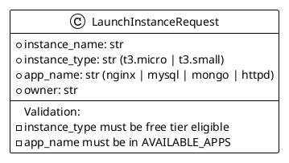

# py2puml - Automated Python to PlantUML

**py2puml** bridges Python code and PlantUML diagrams by automatically analyzing Python modules and generating PlantUML class diagrams.

## Overview

py2puml automatically converts Python code to PlantUML format, making it easy to:
- Keep diagrams synchronized with code changes
- Document class hierarchies automatically
- Generate class diagrams without manual effort
- Maintain version control of diagram sources

## Installation

```bash
# Install py2puml
pip install py2puml==0.9.0

# Install plantuml for PNG/SVG rendering
pip install plantuml
sudo apt-get install default-jre plantuml

# Verify installation
py2puml --help
```

## Quick Start

```bash
# Generate PlantUML from Python code
bash generate.sh

# Output files:
# - app.puml         (PlantUML source - text-based)
# - app.png          (Rendered class diagram)
# - app.svg          (Scalable vector version)
```

## What It Generates

### app.puml
Auto-generated PlantUML class diagram containing:
- All classes defined in `app/` module
- Pydantic models: `LaunchInstanceRequest`, `LaunchInstanceResponse`, `TaskStatus`, etc.
- Custom classes: `JSONFormatter`
- Relationships: inheritance from `BaseModel`
- Fields: attributes and their types

**Example structure** (generated automatically):
```plantuml
class BaseModel {
}

class LaunchInstanceRequest {
  +instance_name: str
  +instance_type: str
  +app_name: str
  +owner: str
}

class TaskStatus {
  +task_id: str
  +status: str
  +instance_id: Optional[str]
  +public_ip: Optional[str]
  +message: str
}

BaseModel <|-- LaunchInstanceRequest
BaseModel <|-- TaskStatus
```

### app.png / app.svg
Rendered diagrams suitable for:
- README.md embedding
- Documentation
- Presentations
- PR reviews

## Usage

### Generate Automatically

```bash
bash generate.sh
```

This will:
1. Analyze Python module `app/`
2. Generate `app.puml` (PlantUML source)
3. Convert to `app.png` and `app.svg` (if plantuml installed)

### Generate Specific Python Module

```bash
# Generate from specific module
py2puml /path/to/module module_name > output.puml

# Example for EC2-Automator
py2puml app ec2_automator > app.puml
```

### Customize Generated PlantUML

Edit `app.puml` manually:


### Render to PNG/SVG

```bash
plantuml -tpng app.puml
plantuml -tsvg app.svg
```

### Embed in Documentation

**README.md**:
```markdown
## Architecture - Class Diagram


```

## How It Works

py2puml:
1. Imports the Python module
2. Inspects class definitions using `inspect` module
3. Extracts inheritance relationships
4. Extracts attributes and type annotations
5. Generates PlantUML syntax
6. Outputs to `.puml` file

## For EC2-Automator

**py2puml generates**:
- All Pydantic model classes
- Relationships with `BaseModel`
- Attributes with type hints
- `JSONFormatter` custom class
- Any other classes in `app/` package

**This is useful for**:
- Understanding data models
- API contract documentation
- Onboarding developers
- Class inheritance validation

**Limitations**:
- Only shows class definitions, not usage
- Doesn't show method implementations
- Limited relationship information
- No sequence or interaction diagrams

## Comparison with pyreverse

| Feature | py2puml | pyreverse |
|---------|---------|-----------|
| Auto-generation | ✅ | ✅ |
| Output format | PlantUML | PNG, DOT |
| Customizable | ✅ | Limited |
| Python code analyzed | ✅ | ✅ |
| Performance | Faster | Slightly slower |
| Relationship detail | Basic | More detailed |
| Method signatures | Basic | Detailed |

## Workflow Integration

### 1. On Every Commit
```bash
# Pre-commit hook
#!/bin/bash
cd uml/py2puml
bash generate.sh
git add app.puml app.png app.svg
```

### 2. On PR Reviews
```bash
# Check if classes changed
git diff main.. app/
# Regenerate diagram
bash uml/py2puml/generate.sh
# Review class changes in PR
```

### 3. In CI/CD
```yaml
# GitHub Actions
- name: Generate py2puml diagrams
  run: bash uml/py2puml/generate.sh
- name: Upload artifacts
  uses: actions/upload-artifact@v2
  with:
    name: py2puml-diagrams
    path: uml/py2puml/*.png
```

## Troubleshooting

### py2puml not found
```bash
pip install py2puml --upgrade
which py2puml
```

### Empty or minimal output
- Check that `app/` contains classes
- Verify module has proper `__init__.py`
- Try: `py2puml -h` for help

### PlantUML not rendering
- Install plantuml: `pip install plantuml && sudo apt-get install plantuml`
- Check Java: `java -version`
- Try standalone rendering: `plantuml -tpng app.puml`

### Module import errors
- Ensure all dependencies are installed: `pip install -r requirements.txt`
- Check Python path: `export PYTHONPATH="${PYTHONPATH}:$(pwd)"`
- Verify module structure

## Advanced Usage

### Generate Multiple Modules

```bash
# Generate from multiple directories
py2puml app app > app.puml
py2puml app/aws aws > aws.puml
py2puml app/utils utils > utils.puml
```

### Include Type Hints

py2puml automatically includes type hints when available:
```python
# Python code
class MyClass:
    name: str
    count: int

# Generated PlantUML
class MyClass {
  +name: str
  +count: int
}
```

### Skip Certain Classes

Edit `.puml` file to remove unwanted classes before converting to PNG.

## Future Enhancements

- [ ] Custom filtering of classes to include/exclude
- [ ] Method signature generation
- [ ] Relationship inference
- [ ] Configuration file support
- [ ] Automatic diagram diffing

## References

- [py2puml GitHub](https://github.com/lucyking/py2puml)
- [PlantUML Documentation](https://plantuml.com)
- [Python inspect Module](https://docs.python.org/3/library/inspect.html)

---

**Tool Type**: Code-to-Diagram Converter
**License**: Apache-2.0
**Requires**: Python 3.6+
**Optional**: PlantUML for rendering
